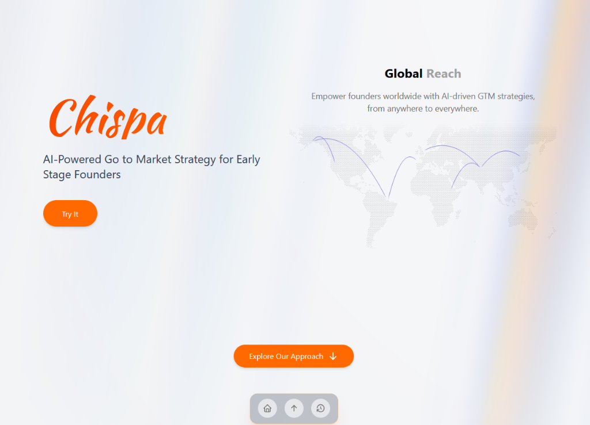

<div align="center">
  
  <h1>Chispa</h1>
  <p><strong>AI-Powered Go to Market Strategy for Early Stage Founders</strong></p>
</div>

<br />

Chispa helps early-stage founders build their Go-to-Market (GTM) strategy by synthesizing fragmented insights and market data into structured, actionable guidance using AI.

## ✨ Key Features

- **🧠 AI Engine**: Synthesizes inputs (industry, target market, product) into comprehensive GTM strategies, competitor insights, and positioning.
- **📊 Interactive Dashboard**: A clean, actionable dashboard that provides pitch-ready outputs.
- **🌍 World Map Visualization**: Visualize global reach and market data.
- **⚓ Floating Dock**: Seamless navigation across the application.

## 🛠️ Tech Stack

- **Frontend**: [Next.js](https://nextjs.org/), [React](https://react.dev/), [Tailwind CSS](https://tailwindcss.com/), [Framer Motion](https://www.framer.com/motion/)
- **Backend/AI**: Python

## 🚀 Getting Started

Follow these steps to set up the project locally.

### Prerequisites

- Node.js (v18 or later)
- Python (v3.8 or later)

### Installation

1. **Clone the repository**
   ```bash
   git clone https://github.com/yourusername/chispa-web.git
   cd chispa-web
   ```

2. **Install Frontend Dependencies**
   ```bash
   npm install
   # or
   yarn install
   # or
   pnpm install
   ```

3. **Install Backend Dependencies**
   ```bash
   # It is recommended to use a virtual environment
   python -m venv venv
   source venv/bin/activate  # On Windows: venv\Scripts\activate
   pip install -r requirements.txt
   ```

4. **Run the Development Server**
   ```bash
   npm run dev
   ```

   Open [http://localhost:3000](http://localhost:3000) with your browser to see the result.

## 📄 License

This project is licensed under the MIT License.
